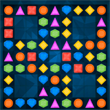

# Jewelsback

> A match-3 inspired game created for the js13kGames 2019 competition.

Yes, falling jewels are back... Again.

[Play now](https://erickpetru.github.io/js13k-jewelsback)
 | 
[Competition entry](https://js13kgames.com/entries/jewelsback)

# How to play

_Didn't you played a match-3 game? Where did you lived until today?_ 🤣

You just need to click and drag jewels (or touch in case of mobile devices) to create horizontally or vertically matches of the same shape. The game has _13 levels_ and the win is achieved when reaching _score 13000_.

# Versions

The live version served [here](https://erickpetru.github.io/js13k-jewelsback) at Github Pages is improved with some `webp` images and some `mp3` and `ogg` sounds, all retrieved from [opengameart.org](opengameart.org).

Since the competition rules consider external assets as part of the 13KB limit, the competition version wiped them out. If you're puritane about the size limit, [play the competition version](https://js13kgames.com/games/jewelsback/index.html).

# Technologies

The game was created with open Web technologies in mind for the distributable build (i.e. no gaming engine was used), focusing in some bleding edge features since the competition only cares about supporting lastest Firefox and Chrome versions. But for development, there are some interesting things to note:

- **Parcel** bundler was choose mostly because of its out-of-the-box bundling with _tree shaking_ and preprocessors support. Without Parcel, the work on adjusting the build proccess would not be feasible to deliver in time.
- **Pug** was used in the source of `index.html` just because Parcel supports it very well and I liked the simplified syntax.
- **Stylus** is the best CSS preprocessor IMHO. As this game used many CSS solutions - board positioning with CSS Grid, jewels layout and moving, animations, transitions and cool effects - the Stylus features offered a boost in development productivity.
- **Web Components** are really powerful and are already ready to use in modern browsers. Along with some **ECMAScript 2015+** sugars like `class`, `Promise` and `async`/`await`, it enabled a very modularized code with good encapsulation. Because of the small amount of time to work on this project, there are still many places to improve (as the very big `Board.js` file). But I'm happy with how much can be done with pure modern JavaScript this days!

## License

Copyright &copy; 2019.

Licensed under the [MIT license](LICENSE).
